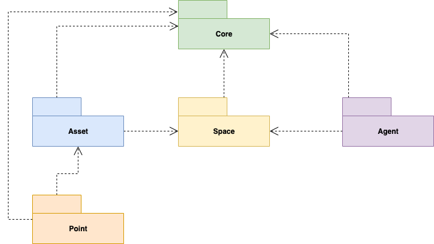
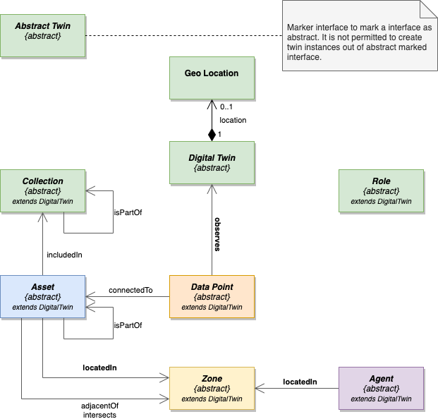
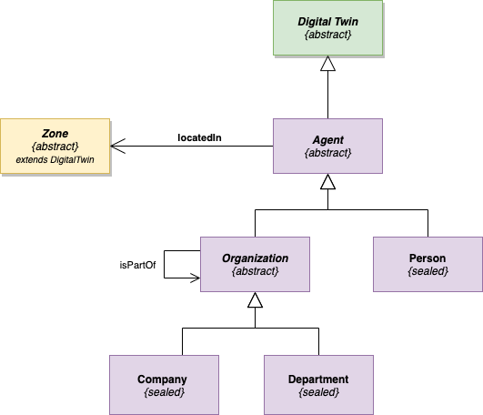
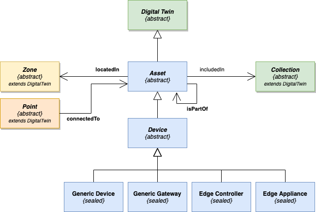
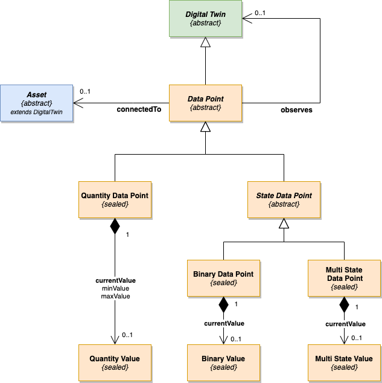
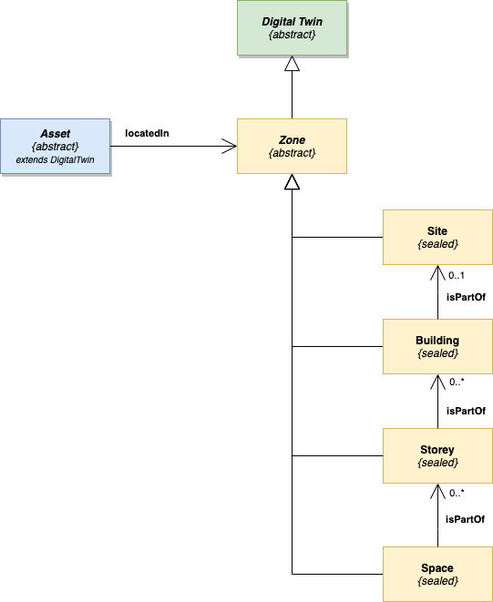

# Bosch Building Technologies - Foundation Ontology

> Version 2.0.0

## Overview

The [Bosch Building Technologies](https://www.boschbuildingtechnologies.com) **foundation ontology** defines the digital "***Foundation***" for all domain specific ontology models.

**History:** The `Foundation Ontology` is the next generation of the previous [`Basic`](https://github.com/bosch-bt/ontology-central/tree/master/com/bosch/bt/Basic/1.0.0) and [`Spaces`](https://github.com/bosch-bt/ontology-central/tree/master/com/bosch/bt/Spaces/1.0.0) ontology model, therefore the ontology model has the versions number `2.0.0`.

## Motivation and Purpose

The **foundation ontology** is the digital common foundation layer (a shared domain kernel) of [Bosch Building Technologies](https://www.boschbuildingtechnologies.com) domain ontology models. All the common aspects for a building digital twin are defined by this **foundation ontology**. This **foundation ontology** allows cross domain (service) considerations and enables a dynamic extension point for a `Digital Twin` by using roles.

## Foundation Structure

The diagram below gives an overview of the sub-modules of the **foundation ontology** and their dependencies.

The diagram below shows the `Core` of the **foundation ontology** the set of core models with their relationships.

The foundation ontology consists of a core set of models (interfaces):

- **Abstract Twin** marker interface for a abstract twin interface.
- **Geo Location** a GeoJSON point to define a geo location as component relationship.
- **Digital Twin** base interface for all ontology interfaces.
- **Collection** grouping of digital twins into a system context  
- **Role** of digital twin in the given domain context, e.g. energy consumer role.
- **Asset** object which is placed inside of a building, but which is not an integral part of that building's structure, for example architectural, furniture, equipment, systems, etc.
- **Data Point** Points are typically a value from a digital or analog sensor or actuator entity (command) and might hold their values as time series in an external data store. 
- **Zone** part of the physical world that has a 3D spatial extent and that contains or can contain sub-spaces. 
- **Agent** basic types of stakeholder that can have roles or perform activities, e.g., people, companies, departments.

The foundation ontology contains a number of relationship types, here we list the main ones:

- **observes** connect a `Data Point` with any `Digital Twin` which is observed by the point.
- **locatedIn** `Asset` or `Agent` is contained in a physical `Zone`
- **connectedTo** connect a `Data Point` with an `Asset`
- **includedIn** connects a `Asset`  with a collection for example a system (HVAC collection)

## Foundation Agent Structure

The diagram below shows the `Agent` related models of the **foundation ontology** and their relationships.

## Foundation Asset Structure

The diagram below shows the `Asset` related models of the **foundation ontology** and their relationships.
The specific assets are defined in the models of the domains e.g. in the HVAC ontology the asset AHU is defined.

## Foundation Point Structure

The point sub module is motivated by [Project Haystack Points](https://project-haystack.org/doc/docHaystack/Points) definition and standards like [Semantic Sensor Network Ontology](https://www.w3.org/TR/vocab-ssn/). The diagram below shows the `Point` related models of the **foundation ontology** and their relationships.

A data point is described by the following properties:

- **type** the type of the data point e.g. `CO2`, `Counter`, `Speed`, `Temperature`, ...   (see also [Microsoft RealEstateCore Ontology - Capabilities](https://github.com/Azure/opendigitaltwins-building/tree/master/Ontology/Capability))
- **function** classifies the point as `Sensor`, `Setpoint`, `Command` or `Virtual`   (see also [Project Haystack - pointFunctionType](https://project-haystack.org/doc/lib-phIoT/pointFunctionType))
- **measurementType** Type of the measurement: `Absolute`, `Relative` or `Delta`
- **section** data point equipment (asset) section of ductwork: `Discharge`, `Return`, ...   (see also [Project Haystack - Duct Section Type](https://project-haystack.org/doc/lib-phIoT/ductSectionType))
- **effectiveBounds** bounds in which the data point value is valid: `In`, `Out`, ...
- **medium** what the data point senses or controls: `Air`, `Water`, `Gas`, ...

## Foundation Space Structure

The diagram below shows the `Zone` related models of the **foundation ontology** and their relationships.
Model is motivated by the W3C BOT ontology for more details see <https://w3c-lbd-cg.github.io/bot/>.

## BOT Mapping (Spaces and Asset)

This section describes the mapping of the Bosch Building Technologies Foundation Ontology into the BOT classes and relationships.

### Classes (Types) Mapping

BOT Class | Description | Mapping
--- | --- | ---
`bot:Zone`| A part of the physical world or a virtual world that is inherently both located in this world and has a 3D spatial extent | **No mapping** - concept not supported (only abstract Zone interface)
`bot:Site`| Site is intended to contain or contains one or more buildings. | `Site`
`bot:Building`| Building is contained in a building site, and can contain one or more storeys that are vertically connected. | `Building`
`bot:Storey`| A `bot:Storey` is contained in one or more buildings, and is intended to contain one or more spaces that are horizontally connected.  | `Storey`
`bot:Space`| Space provides for certain functions within the zone it is contained in.  | `Space`
`bot:Element` | Constituent of a construction entity with a characteristic technical function, form or position. | `Asset`
`bot:Interface` | Quantify a relationship between two elements or zones | **No mapping** - concept not supported

### Relationship Mapping

BOT Relationship | Description | Mapping
--- | --- | ---
`bot:containsZone` | Relationship to the subzones of a major zone. | `Zone::belongsTo`,   `Building::isPartOf`,   `Storey::isPartOf`,   `Space::isPartOf`
`bot:hasBuilding` | Relation to buildings contained in a zone. | `Building::isPartOf`
`bot:hasStorey` | Relation to storeys contained in a zone. | `Storey::isPartOf`
`bot:hasSpace` | Relation to spaces contained in a zone. | `Space::isPartOf`
`bot:adjacentZone` | Relationship between two zones that share a common interface, but do not intersect. | **No mapping** - concept not supported 
`bot:intersectsZone` | Relationship between two zones whose 3D extent intersect. For example, a stairwell intersects different storeys. |  **No mapping** - concept not supported
`bot:hasSubElement` | Relation between two building elements, hosting another or subcomposition of elements. | `Asset` - `isPartOf`
`bot:hasElement` | Links a Zone to an Element, contained or adjacent to or intersecting | `Asset` - `locatedIn` only contained semantic can be mapped!
`bot:containsElement` | Relation to a building element contained in a zone. | `Asset` - `locatedIn`
`bot:adjacentElement` | Relation between a zone and its adjacent building elements, bounding the zone. | **No mapping** - concept not supported
`bot:intersectingElement` | Relation between a Zone and a building Element that intersects it. | **No mapping** - concept not supported
`bot:hasZeroPoint` | Links a `bot:Site` to an instance that encodes the latitude and longitude of the Zero Point of the building site. This could be an instance of a wgs84:Point. | **No mapping** - concept not supported   Location as a point can be defined for all twins see `DigitalTwin`.
`bot:hasSimple3DModel`| Links any bot:Zone or bot:Element to a 3D Model encoded as a literal. | **No mapping** - concept not supported
`bot:has3DModel`| Links any `bot:Zone` or `bot:Element` to a IRI that identifies its 3D Model. | **No mapping** - concept not supported

## Using Foundation Ontology

The **foundation ontology** can only be used at least with one domain ontology model e.g. `HVAC` ontology model.

## Extending the Foundation Ontology

- Concrete models (ADT types) e.g. `Building`, denoted with non-italic names in the diagrams, are not allowed to extend. To add new aspects (properties and/or relationships) to such elements use a `Role` twin 
- All concrete asset types are defined in the ontology models of the concrete domains. For example, the `HVAC` ontology model defines the equipment type `Air Handling Unit`.
- Further considerations (aspects) for equipment e.g. energy consumer can be added as role twins, especially when spreading orthogonally accross different domain models.
- Relationships to models in the `Foundation` and to models in the own ontology models are allowed. Direct cross-domain relationships (across domain models e.g. `HVAC` and `Fire` ontology) are not allowed.
- All `abstract` models (denoted with italic names in the diagrams) in the `Foundation` define a clear extension point and can be used.
- At least one domain ontology model must have a parent model with one relationship to a foundation model or an extension of foundation model, so that there are no dangling subgraphs consisting just of domain model types.
- Empty models without properties or relationships should be avoided.

## References

The foundation ontology model is inspired by open standards and other open ontology models, the main sources of inspiration are listed below.

- [Project Haystack](https://project-haystack.org/doc/index)
- [RealEstateCore ontology for smart buildings](https://github.com/Azure/opendigitaltwins-building)
- [BOT - Building Topology Ontology](https://w3c-lbd-cg.github.io/bot/)
- [Semantic Sensor Network Ontology](https://www.w3.org/TR/vocab-ssn/)
- [QUDT](http://www.qudt.org/pages/HomePage.html)
- [Digital Twins Definition Language (DTDL)](https://github.com/Azure/opendigitaltwins-dtdl/blob/master/DTDL/v2/dtdlv2.md)
- [Brick - a uniform metadata schema for buildings](https://brickschema.org/)

