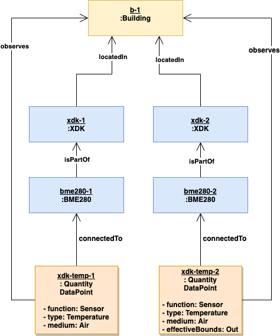
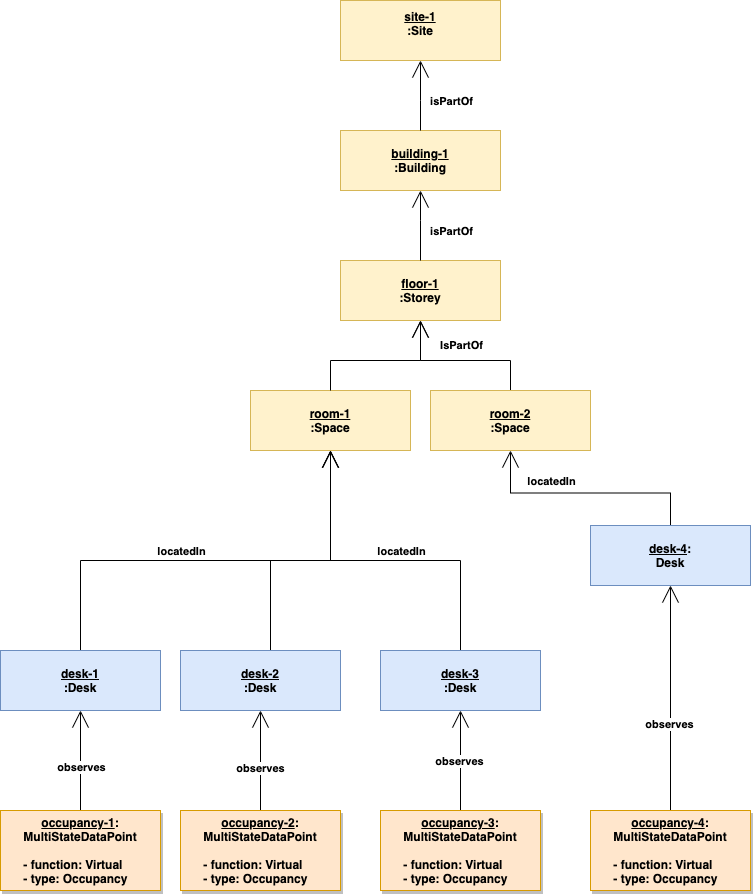

# Foundation Examples

The foundation model development is driven by examples, this documents contains as  scenarios important examples to verify and test models. To run the examples deploy the foundation and the sample `src` folder into a ADT instance.

## Air Temperature of Building

This example shows how to use assets and points, example use cases: 

- `Outside air temperature of a building`
- `Inside air temperature of a building or a room`

The diagram below shows as object diagram the ADT topology.



> In our use cases the sensor (`BME280`) level usually is not important and is not modeled. Simplified, the data point is then connected to the parent equipment (asset) in the example the XDK.

**Create example topology:**

```
addtwin dtmi:com:bosch:bt:foundation:space:Building;2 building-1
addtwin dtmi:com:bosch:bt:samples:XDK;2 xdk-1
addtwin dtmi:com:bosch:bt:samples:XDK;2 xdk-2
addtwin dtmi:com:bosch:bt:samples:BME280;2 bme280-1
addtwin dtmi:com:bosch:bt:samples:BME280;2 bme280-2
addtwin dtmi:com:bosch:bt:foundation:point:QuantityDataPoint;2 temp-1
addtwin dtmi:com:bosch:bt:foundation:point:QuantityDataPoint;2 temp-2

patchtwin temp-1 add type Temperature
patchtwin temp-1 add function Sensor
patchtwin temp-1 add medium Air
patchtwin temp-1 add effectiveBounds In
patchtwin temp-2 add type Temperature
patchtwin temp-2 add function Sensor
patchtwin temp-2 add medium Air
patchtwin temp-2 add effectiveBounds Out

addrel temp-1 building-1 observes
addrel temp-2 building-1 observes
addrel bme280-1 xdk-1 isPartOf
addrel bme280-2 xdk-2 isPartOf
addrel temp-1 bme280-1 connectedTo
addrel temp-2 bme280-2 connectedTo
addrel xdk-1 building-1 locatedIn
addrel xdk-2 building-1 locatedIn
```

**Import** xdk topology: [XDK Temp Topology](./data/xdk-temp-topology.json)


Query for a specific building the outside air temperature from a point:

```
SELECT Point, Building FROM digitaltwins Point JOIN Building RELATED Point.observes WHERE Building.$dtId='building-1' 
        and Point.type='Temperature'
        and Point.effectiveBounds = 'Out'
        and Point.function='Sensor' 
        and Point.medium='Air'
```

Query building points for inside temperature:

```
SELECT Point, Building FROM digitaltwins Point JOIN Building RELATED Point.observes WHERE Building.$dtId='building-1' 
        and Point.type='Temperature'
        and NOT Point.effectiveBounds = 'Out'
        and Point.function='Sensor' 
        and Point.medium='Air'
```

## Desk - desk usage

Example use case: `Desk - desk usage (Desk is used or free, yes or no)`

The diagram below shows as object diagram the ADT topology for spaces and desks.

![Desk Usage Example](./docs/The diagram below shows as object diagram the ADT topology.



**Create example topology:**

```
addtwin dtmi:com:bosch:bt:foundation:space:Site;2 site-1
addtwin dtmi:com:bosch:bt:foundation:space:Building;2 building-1
addtwin dtmi:com:bosch:bt:foundation:space:Storey;2 floor-1
addtwin dtmi:com:bosch:bt:foundation:space:Space;2 room-1
addtwin dtmi:com:bosch:bt:foundation:space:Space;2 room-2

addtwin dtmi:com:bosch:bt:samples:Desk;2 desk-1
addtwin dtmi:com:bosch:bt:samples:Desk;2 desk-2
addtwin dtmi:com:bosch:bt:samples:Desk;2 desk-3
addtwin dtmi:com:bosch:bt:samples:Desk;2 desk-4
addtwin dtmi:com:bosch:bt:foundation:point:MultiStateDataPoint;2 occupancy-1
addtwin dtmi:com:bosch:bt:foundation:point:MultiStateDataPoint;2 occupancy-2
addtwin dtmi:com:bosch:bt:foundation:point:MultiStateDataPoint;2 occupancy-3
addtwin dtmi:com:bosch:bt:foundation:point:MultiStateDataPoint;2 occupancy-4

patchtwin occupancy-1 add type Occupancy
patchtwin occupancy-1 add function Virtual
patchtwin occupancy-2 add type Occupancy
patchtwin occupancy-2 add function Virtual
patchtwin occupancy-3 add type Occupancy
patchtwin occupancy-3 add function Virtual
patchtwin occupancy-4 add type Occupancy
patchtwin occupancy-4 add function Virtual

addrel building-1 site-1 isPartOf
addrel floor-1 building-1 isPartOf
addrel room-1 floor-1 isPartOf
addrel room-2 floor-1 isPartOf

addrel desk-1 room-1 locatedIn
addrel desk-2 room-1 locatedIn
addrel desk-3 room-1 locatedIn
addrel desk-4 room-2 locatedIn

addrel occupancy-1 desk-1 observes
addrel occupancy-2 desk-2 observes
addrel occupancy-3 desk-3 observes
addrel occupancy-4 desk-4 observes
```

**Import** desk topology: [Desk Usage Topology](./data/desk-usage-topology.json)

Query all occupied desks and spaces:

```
SELECT Point, Desk, Space FROM digitaltwins Point 
        JOIN Desk RELATED Point.observes 
        JOIN Space RELATED Desk.locatedIn 
        WHERE Point.$dtId IN ['occupancy-1', 'occupancy-2', 'occupancy-3', 'occupancy-4'] and Point.currentValue.value='Occupied'
```

Query all free desks and spaces:

```
SELECT Point, Desk, Space FROM digitaltwins Point 
        JOIN Desk RELATED Point.observes 
        JOIN Space RELATED Desk.locatedIn 
        WHERE Point.$dtId IN ['occupancy-1', 'occupancy-2', 'occupancy-3', 'occupancy-4'] and Point.currentValue.value='Free'
```


