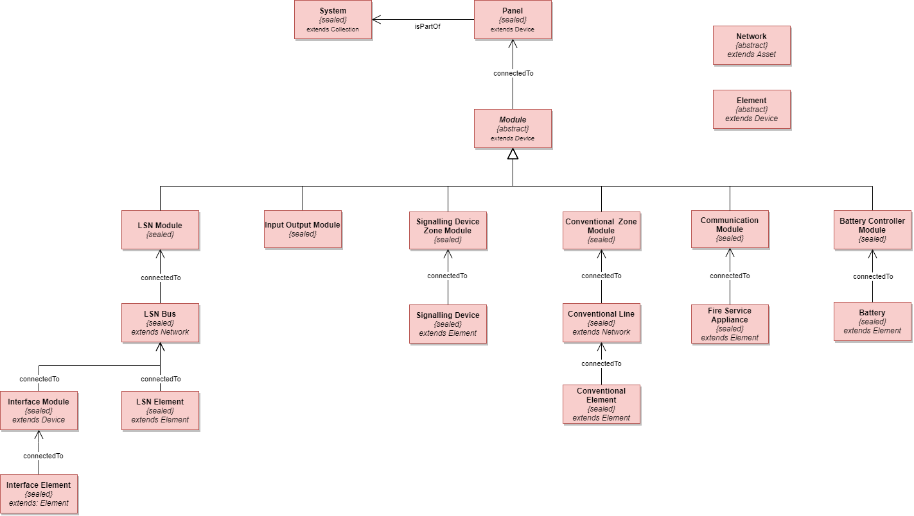
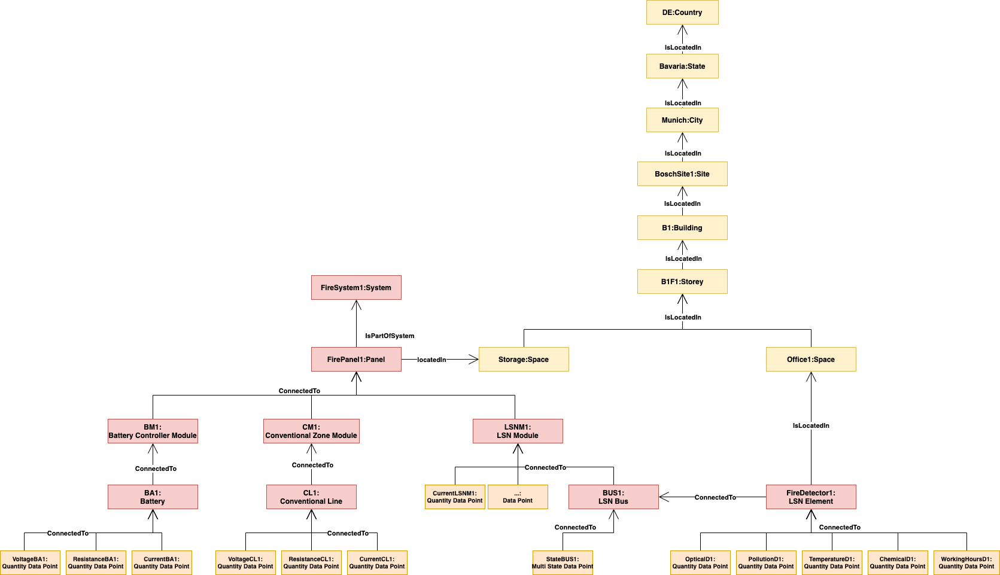
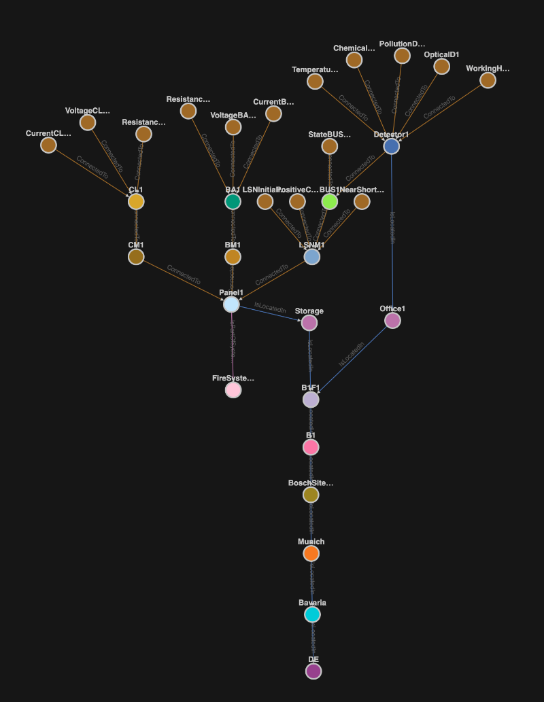

# Bosch Building Technologies - Fire Alarm Systems (FAS) Ontology

> Version 2.0.0

## Overview

The Fire Alarm Systems Ontology is based on the Bosch Foundation Ontology and uses the foundation concepts of `Zone`, `Asset`, `DataPoint` and `Collection`.

The diagram below shows the core elements of the fire ontology, the foundation concepts like points are not shown.

## Topology Samples

The diagram below shows an example of a topology for a fire alarm system, it covers not a complete system but shows all core aspects.

The image below shows this example topology in the ADT Explorer as a graph. Please find the the example topology as ADT Explorer export [here](./samples/data/fire-sample-topology.json).

