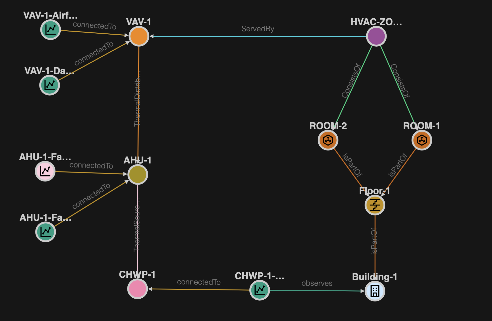

# Bosch Building Technologies - HVAC Systems Ontology

> Version 2.0.0

## Overview

HVAC system ontology to describe  HVAC entities like  `Dampers`, `Pumps`, `Thermal Distributors` (e.g. `AHU`), `Thermal Exchanger`, and `Thermal Sources` (e.g. `Chillers`).

## Topology Samples

The diagram below shows an example of a topology for a HVAC system, it covers not a complete system only a small sample aspect.

The image below shows this example topology in the ADT Explorer as a graph. Please find the the example topology as ADT Explorer export [here](./samples/data/hvac-topology-simple.json).

